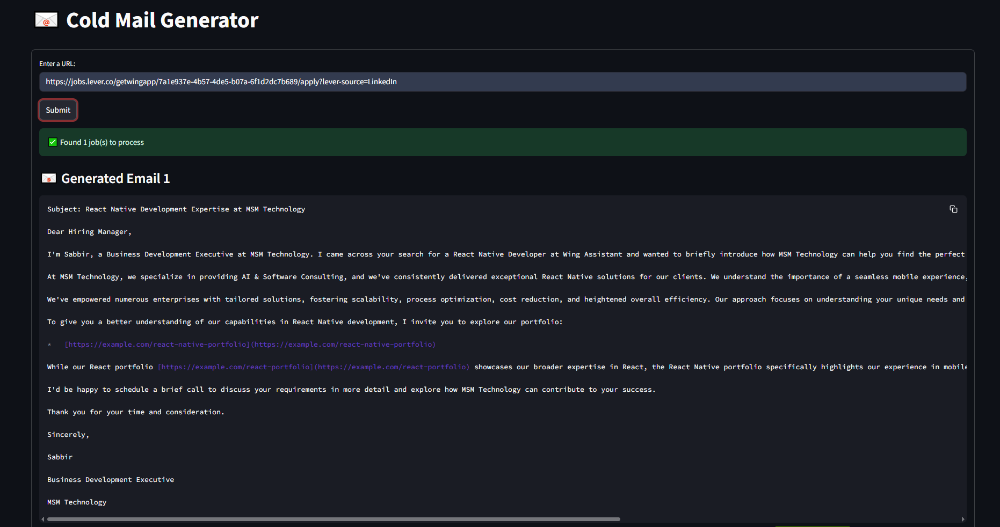

# 📧 Cold Email Generator

An intelligent AI-powered application that automatically generates personalized cold emails for job applications by analyzing job postings and matching them with relevant portfolio items.



## 🎯 Project Overview

The Cold Email Generator is a sophisticated web application that leverages the power of Large Language Models (LLMs) to streamline the job application process. It automatically extracts job requirements from web pages, analyzes the content, and generates personalized cold emails that highlight relevant portfolio items.

### 🚀 Key Features

- **🔍 Smart Job Analysis**: Automatically extracts job requirements, skills, and descriptions from any job posting URL
- **📝 AI-Powered Email Generation**: Creates personalized, professional emails using Google Gemini AI
- **🎯 Intelligent Portfolio Matching**: Uses FAISS vector database to match job requirements with relevant portfolio items
- **🌐 Web Scraping**: Seamlessly extracts content from job posting websites
- **💼 Professional Templates**: Generates business-ready email content with proper formatting
- **⚡ Real-time Processing**: Fast and efficient processing with beautiful loading animations
- **🛡️ Error Handling**: Comprehensive error handling for various edge cases

## 🛠 Technology Stack

### Core Technologies
- **Python 3.13+**: Primary programming language
- **Streamlit 1.48.0**: Web application framework for rapid development
- **LangChain 0.3.27**: LLM orchestration and prompt management
- **Google Gemini AI**: Advanced language model for content generation

### AI/ML Libraries
- **FAISS 1.7.4**: High-performance vector similarity search
- **Sentence Transformers 2.2.2**: Text embedding generation using 'all-MiniLM-L6-v2'
- **Pandas 2.3.1**: Data manipulation and CSV processing

### Web Scraping & Processing
- **LangChain Community**: WebBaseLoader for content extraction
- **BeautifulSoup4**: HTML parsing and content cleaning
- **Requests**: HTTP client for web scraping

### Development & Utilities
- **Python-dotenv**: Environment variable management
- **UUID**: Unique identifier generation
- **NumPy**: Numerical computing support

## 📁 Project Structure

```
ColdEmailGenerator/
├── README.md                    # This documentation file
├── main.py                      # Streamlit application entry point
├── chains.py                    # LangChain processing logic
├── portfolio.py                 # FAISS vector database management
├── utils.py                     # Utility functions for text cleaning
├── requirements.txt             # Python dependencies
├── .env                         # Environment variables (create this)
├── resources/                   # Project resources
│   └── my_portfolio.csv        # Portfolio data with tech stacks and links
└── vectorstore/                 # FAISS index storage
    ├── faiss_index.bin         # FAISS vector index
    └── metadata.pkl            # Portfolio metadata (links)
```

## 🚀 Quick Start

### Prerequisites
- Python 3.13 or higher
- Google Gemini AI API key
- Git

### Installation

1. **Clone the repository**
   ```bash
   git clone https://github.com/yourusername/LLM_Projects.git
   cd LLM_Projects
   ```

2. **Create virtual environment**
   ```bash
   python -m venv venv
   source venv/bin/activate  # On Windows: venv\Scripts\activate
   ```

3. **Install dependencies**
   ```bash
   pip install -r requirements.txt
   ```

4. **Set up environment variables**
   ```bash
   # Create .env file
   echo "GOOGLE_API_KEY=your_google_gemini_api_key_here" > .env
   ```

5. **Run the application**
   ```bash
   streamlit run ColdEmailGenerator\main.py
   ```

6. **Access the application**
   Open your browser and navigate to `http://localhost:8501`

## 🔧 Configuration

### Environment Variables

Create a `.env` file in the project root:

```env
GOOGLE_API_KEY=your_google_gemini_api_key_here
```

### API Key Setup

1. **Get Google Gemini AI API Key**:
   - Visit [Google AI Studio](https://makersuite.google.com/app/apikey)
   - Create a new API key
   - Copy the key to your `.env` file

### Portfolio Data

The application uses a CSV file (`resources/my_portfolio.csv`) with the following structure:

```csv
"Techstack","Links"
"React, Node.js, MongoDB","https://example.com/react-portfolio"
"Python, Django, MySQL","https://example.com/python-portfolio"
```

**Format:**
- **Techstack**: Comma-separated list of technologies/skills
- **Links**: URL to the corresponding portfolio item

## 🎮 Usage Guide

### Step-by-Step Process

1. **Enter Job URL**
   - Paste a job posting URL in the input field
   - Click "Submit" or press Enter

2. **Automatic Processing**
   - The app validates the URL format
   - Checks URL accessibility
   - Extracts content from the webpage
   - Analyzes job requirements and skills

3. **Email Generation**
   - Matches job skills with portfolio items
   - Generates personalized cold emails
   - Displays results with professional formatting

### Example Workflow

```
Input: https://example.com/jobs/senior-react-developer/
↓
URL Validation & Accessibility Check
↓
Web Content Extraction
↓
Job Information Extraction (role, experience, skills, description)
↓
Portfolio Matching (FAISS similarity search)
↓
AI Email Generation
↓
Display Professional Cold Email
```

## 🔍 How It Works

### 1. Job Analysis Pipeline

```python
# Extract job information from web content
jobs = llm.extract_jobs(cleaned_text)
# Returns: [{"role": "...", "experience": "...", "skills": [...], "description": "..."}]
```

### 2. Portfolio Matching

```python
# Match job skills with portfolio items
skills = job.get('skills', [])
links = portfolio.query_links(skills)
# Returns: [{"links": "https://example.com/portfolio"}]
```

### 3. Email Generation

```python
# Generate personalized email
email = llm.write_mail(job, links)
# Returns: Professional cold email content
```


## 🚀 Deployment

### Local Development
```bash
streamlit run ColdEmailGenerator\main.py
```

### Streamlit Cloud Deployment
1. Push your code to GitHub
2. Connect your repository to Streamlit Cloud
3. Set environment variables in Streamlit Cloud dashboard
4. Deploy automatically

### Environment Variables for Deployment
```bash
GOOGLE_API_KEY=your_google_gemini_api_key_here
```

## 🧪 Testing

### Manual Testing
1. **URL Validation**: Test with invalid URLs
2. **Content Extraction**: Test with various job posting formats
3. **Email Generation**: Verify email quality and relevance
4. **Error Handling**: Test with network issues and invalid content

### Test Cases
- ✅ Valid job posting URLs
- ✅ Invalid URLs (404, 403, timeout)
- ✅ Empty or minimal content
- ✅ Various job posting formats
- ✅ Network connectivity issues

## 🔧 Customization

### Adding New Portfolio Items
1. Edit `resources/my_portfolio.csv`
2. Add new rows with tech stacks and links
3. Restart the application to rebuild the FAISS index

### Modifying Email Templates
Edit the prompt template in `chains.py`:

```python
prompt_email = PromptTemplate.from_template(
    """
    ### JOB DESCRIPTION:
    {job_description}

    ### INSTRUCTION:
    [Your custom instructions here]
    """
)
```

### Changing AI Model
Modify the model initialization in `chains.py`:

```python
self.llm = init_chat_model("your-model-name", model_provider="your-provider")
```

## 🐛 Troubleshooting

### Common Issues

**1. API Key Error**
```
Error: Invalid API key
Solution: Verify your GOOGLE_API_KEY in .env file
```

**2. URL Accessibility Issues**
```
Error: URL Not Accessible
Solution: Check if the URL is publicly accessible and not blocked
```

**3. Content Extraction Failures**
```
Error: No Content Found
Solution: The webpage might be using JavaScript rendering or blocking scrapers
```

**4. FAISS Index Issues**
```
Error: FAISS index not found
Solution: Delete vectorstore/ folder and restart the application
```

## 📊 Performance Metrics

### Current Performance
- **URL Processing**: ~2-5 seconds
- **Content Extraction**: ~3-7 seconds
- **Email Generation**: ~5-10 seconds
- **Total Response Time**: ~10-22 seconds

### Optimization Opportunities
- Implement caching for repeated URLs
- Use async processing for parallel operations
- Optimize FAISS index for faster queries

## 🔮 Future Enhancements

### Planned Features
- **Multi-language Support**: Generate emails in different languages
- **Email Templates**: Multiple email style options
- **Analytics Dashboard**: Track email performance metrics
- **Integration APIs**: Connect with job boards and email services
- **Advanced Matching**: More sophisticated portfolio-job matching algorithms

### Technical Improvements
- **Async Processing**: Implement async/await for better performance
- **Caching System**: Redis integration for faster responses
- **Database Integration**: PostgreSQL for better data management
- **API Endpoints**: RESTful API for external integrations


---

<div align="center">

**Made with ❤️ and ☕ by Sabbir**

[](https://www.python.org/)
[](https://streamlit.io/)
[](https://langchain.com/)
[](https://faiss.ai/)
[](LICENSE)

</div> 